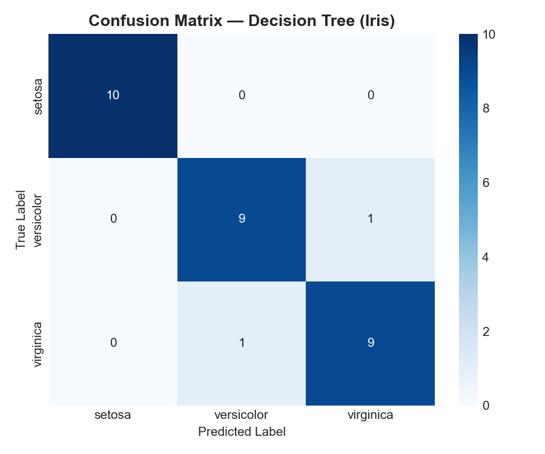

# Project 2 — Data Classification Using AI

**DecodeLabs Internship** — A basic classification model using the Iris dataset and a Decision Tree classifier.

---

## Setup & Run

```
pip install -r requirements.txt
python classifier.py
```

---

## What It Does

1. Loads the Iris dataset from sklearn and prints shape, features, and sample rows
2. Splits the data into 80% training / 20% testing
3. Trains a Decision Tree classifier
4. Prints accuracy, a classification report, and the confusion matrix
5. Saves the confusion matrix as a heatmap in `outputs/`

---

## Result



The model got 93.33% accuracy — it misclassified one versicolor as virginica and one virginica as versicolor. Setosa was predicted perfectly.

---

## What I Learned

- Splitting data before training is essential — without a test set you have no way to know if the model actually learned anything or just memorized.
- Decision Trees split on the most informative feature at each step, which makes them easy to reason about compared to black-box models.
- A confusion matrix tells you *where* the model fails, not just how often — here the two mistakes are both between versicolor and virginica, which makes sense since they overlap more in the feature space.
